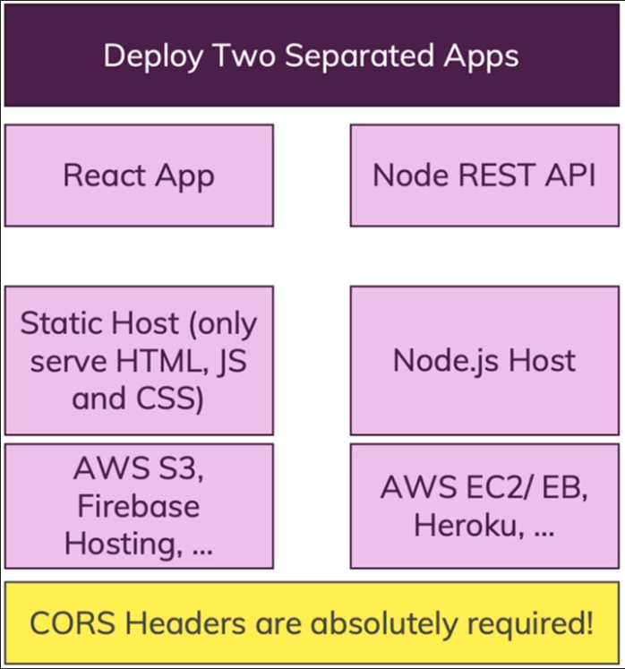
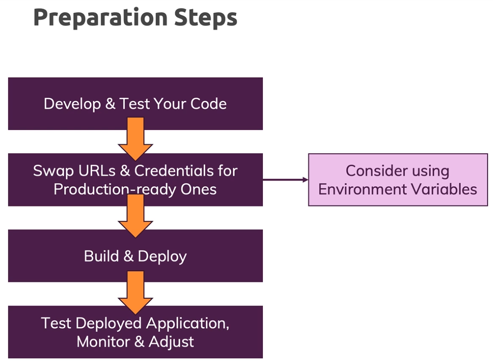

# Hybrid-app

## 구성


## 앱 배포 과정


### 두 개의 분리된 앱 배포
- **필요 서버**: 2개
  - **FrontEnd**: `AWS S3`, Firebase Hosting 등
  - **BackEnd**: AWS EC2/EB, `Heroku` 등
- **특징**: FrontEnd와 BackEnd 간의 통신을 위해 `CORS 헤더`가 필요

___

#### 
# 구성
#### 
- NodeJS -- Express -- React
- MVC 패턴 (model–view–controller, MVC)
- mongoose (mongoDB), (cloud Server DB : Atlas)
  - [MongoDB Atlas](https://cloud.mongodb.com/v2#/org/66fcba7d069a4d43c73cf7af/projects)
- 구글 MAP_API 사용
  - [Google Cloud Console](https://console.cloud.google.com/apis/credentials?hl=ko&project=effective-brook-437306-h0)
- FrontEnd 서버
  - ***AWS s3***
    - [awsS3] https://eu-north-1.console.aws.amazon.com/console/home?region=eu-north-1#
- BackEnd 서버
  - ***heroku***
    - [heroku] https://dashboard.heroku.com/

___

#### 
# FrontEnd( JavaScript, React ) 배포
#### 

### 환경변수 설명
  - `.env` <- Local Test ( with local backend )
  - `.env.production` <- Local Test ( with hosted backend )
  - `github에 "Actions secrets and variables"` <- AWS S3 버킷 업로드 코드 ( with hosted backend )

### Library 설치
```bash
$ npm i
```
package.json 참조
```json
  "dependencies": {
    "axios": "^1.7.7",
    "chalk": "^5.3.0",
    "jwt-decode": "^4.0.0",
    "react": "^16.11.0",
    "react-dom": "^16.11.0",
    "react-router-dom": "5.3.4",
    "react-scripts": "3.2.0",
    "react-transition-group": "^4.4.5"
  }
```

### FrontEnd code 배포판 빌드
```bash
# npm run build 시, .env.production 환경변수를 참조해 빌드한다.
$ npm run build
```

### Local Test ( with hosted backend )
```bash
$ npm install -g serve  # serve 패키지를 전역(global)설치 <- 한번만 하면 됨
$ serve -s build  # localhost:3000 으로 서버구성해서 build 디렉토리에 있는 코드 로컬실행
```

### Local Test ( with local backend )
```bash
$ npm start  # localhost:3000 으로 서버구성해서 app.js 실행 (build 디렉토리 X)
```

### 실행 에러 정리
```bash
# node -v 버전이 12 이하인 경우 최신버전 설치
$ curl -o- https://raw.githubusercontent.com/nvm-sh/nvm/v0.39.5/install.sh | bash
$ source ~/.bashrc
$ nvm --version
$ nvm install --lts
$ nvm use --lts
$ node -v

# 구버전으로 인한 실행 실패시, package.json에 해당 Json Script 추가
  "scripts": {
    "start_origin": "react-scripts start",
    "build_origin": "react-scripts build",
    "start": "react-scripts --openssl-legacy-provider start",
    "build": "react-scripts --openssl-legacy-provider build",
    ....기존의 Script 이어서...
```

___


#### 
# FrontEnd server( AWS S3 ) 업로드
#### 

### AWS S3 업로드
  - `https://eu-north-1.console.aws.amazon.com/s3/home?region=eu-north-1#` 
  - 해당링크에서 APP 전용 도메인 버킷에 업로드
  - FrontEndProd에 `Release_v*.*` 커밋명으로 푸시 ( Git Action -> IAM 자동 업로드 )

___

#### 
# BackEnd( JavaScript, NodeJS, ExpressJS ) 배포
#### 

### 환경변수 설명
  - `.nodemoon` [개발전용]
  - `heroku 로그인 -> Settings -> Config Vars -> Reveal Config Vars` [배포전용]

### Library 설치
```bash
$ npm i
```
package.json 참조
```json
  "dependencies": {
    "axios": "^1.7.7",
    "bcryptjs": "^2.4.3",
    "body-parser": "^1.20.3",
    "console-log-level": "^1.4.1",
    "express": "^4.21.0",
    "express-validator": "^7.2.0",
    "jsonwebtoken": "^9.0.2",
    "mongoose": "^8.7.0",
    "mongoose-unique-validation": "^0.1.0",
    "multer": "^1.4.5-lts.1",
    "uuid": "^3.3.3"
  },
  "devDependencies": {
    "nodemon": "^3.1.7"
  }
```

### BackEnd code 배포판 빌드
```bash
X 필요 없음
```

### Local Test
```bash
$ npm install -g serve
$ serve -s build  # localhost:5000 으로 서버구성해서 build 디렉토리에 있는 코드 로컬실행
```

### Local Test ( with local backend )
```bash
$ nodemon app.js  # localhost:5000 으로 서버구성해서 app.js 실행 (build 디렉토리 X)
```

### 실행 에러 정리
```bash
# nodemon 없으면 설치 필요
$ npm install -g nodemon
$ nodemon -v
```

___

#### 
# BackEnd server 업로드
#### 

### heroku 업로드
  - Automatic deploys from ***본인 깃 Branch*** are enabled  설정 후, 
  - git push 하면 자동(CI/CD) 업로딩 진행

### heroku install
```bash
$ curl https://cli-assets.heroku.com/install-ubuntu.sh | sh
```

### heroku 사용 Command
```bash
# 뭐든 로그인 후 CLI 이용
$ heroku login
# Dyno 끄기
$ heroku ps:scale web=0 --app heroku-app-name
# Dyno 켜기
$ heroku ps:scale web=1 --app heroku-app-name
# 재시작
$ heroku restart --app heroku-app-name
# 애플리케이션 상태 확인
$ heroku ps --app heroku-app-name
# 각종 정보 확인
$ heroku info -a heroku-app-name
# 서버 로그 확인
$ heroku logs --tail --app heroku-app-name
# 환경 변수 설정
$ heroku config:set KEY=VALUE --app heroku-app-name
```

___

#### 
# Android APP 배포
#### 

___

#### 
# IOS APP 배포
#### 

___
